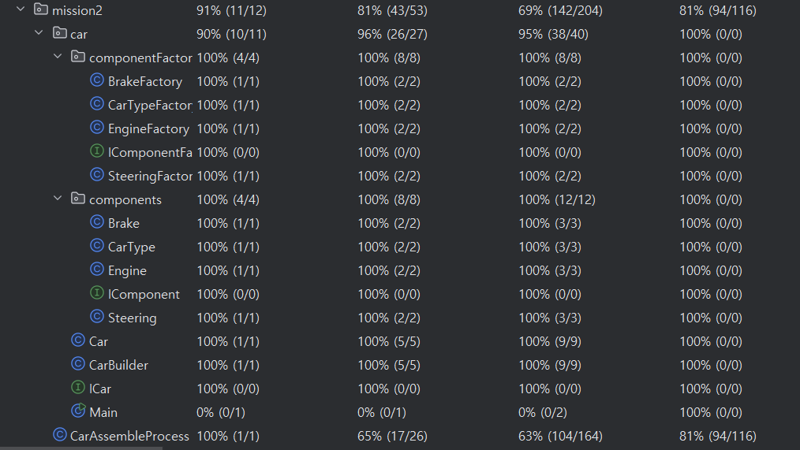
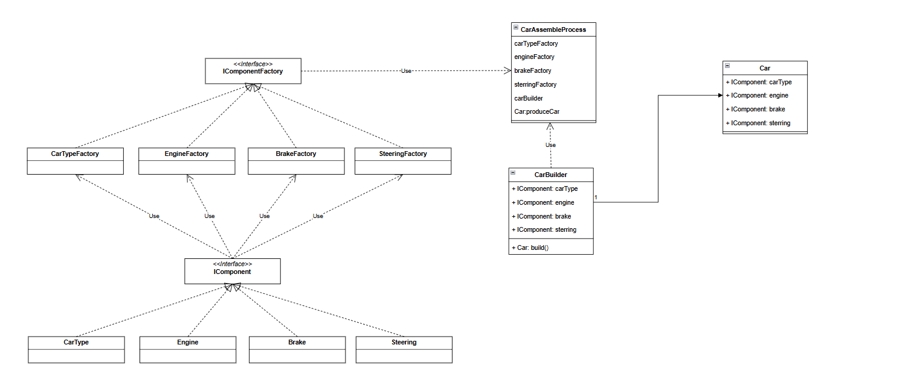

요구사항 체크리스트
-----------------

| 항목 | 적용여부 |                        기타                         |
|:--:|:----:|:-------------------------------------------------:|
| D1 |  O   |    mission 1 및 mission 2 진행시에 추가 clean code 진행    |
| D2 |  O   |        Unit Test 모두 Refactoring 후 유지보수 완료         |
| D3 |  O   |       확장성 고려하여 차를 이루는 부품들에대해 Interface로 구현        |
| D4 |  O   |            Factory, Builder Pattern 사용            |
| D5 |  O   | Method Coverage는 run 및 Console 관련부로 강사님 확인 완료된 건임 |

 

요구사항정리(D1 ~ D5)
---

1. 함수 레벨리팩토링
    - D1 - 가독성있는 코드로 함수분리, 가독성좋은네이밍사용
2. 메서드 레벨리팩토링
    - D2 - Regression Test 를 위한 Unit Test 개발
    - D3 – 확장성을 고려한설계, 부품이 추가되더라도 Client Code에 변경이 없도록 한다.
3. 디자인 패턴사용하기
    - D4 - 리팩토링에 디자인 패턴을적용한다.
4. 코드 커버리지100%
    - D5 - 리팩토링이 끝난 코드에, 코드 커버리지가100% 되어야 한다 
      Coverage 캡쳐화면이 없는 경우, 오답처리

---

---
Class Diagram(약식)
